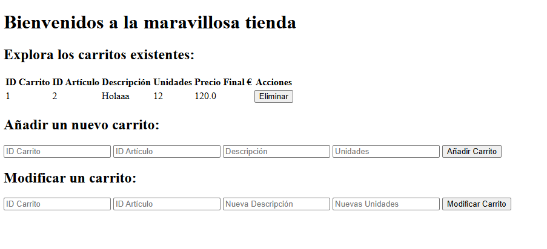
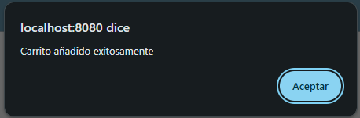
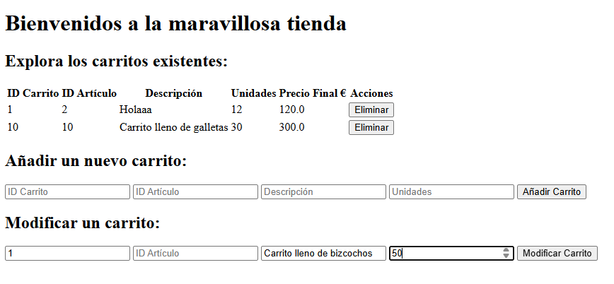
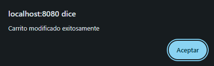
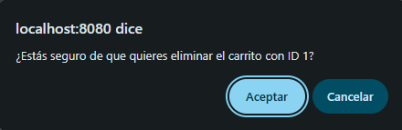

# Práctica 2: Creación API REST - Carrito de Compras

## Descripción del Proyecto

Este proyecto implementa una API REST para gestionar carritos de compra. Se realiza mediante operaciones CRUD (Create, Read, Update, Delete) sobre el recurso `Carrito`, siguiendo el estilo arquitectónico request/response sobre HTTP.

Además, se ha implementado una interfaz web para poder visualizar y manejar los datos desde el navegador.

## Modelo de Datos

El recurso `Carrito` contiene las siguientes propiedades:

- `idCarrito` (Integer): Identificador único del carrito
- `idArticulo` (Integer): Identificador del artículo asociado
- `descripcion` (String): Descripción textual del artículo
- `unidades` (Integer): Número de unidades del artículo (mínimo 1)
- `precioFinal` (Float): Precio final calculado (unidades × 10.0€)

> \[!NOTE]
> Por simplificación, cada carrito solo puede contener un único producto. Todas las propiedades se deben especificar excepto por `precioFinal` que es calculada usando las unidades.

## Endpoints de la API REST

| Método | Ruta | Cuerpo | Descripción | Posibles Respuestas |
|--------|------|----------------------|-------------|---------------------|
| `POST` | `/api/crear` | `{"idCarrito": 1, "idArticulo": 101, "descripcion": "Producto ejemplo", "unidades": 5}` | Crea un nuevo carrito | **200 OK**: Retorna el carrito creado con `precioFinal` calculado **409 CONFLICT**: Si ya existe un carrito con ese ID **400 BAD REQUEST**: Si faltan campos obligatorios o las validaciones fallan |
| `GET` | `/api/consultar/{idCarrito}` | N/A | Consulta un carrito específico por su ID | **200 OK**: Retorna el carrito solicitado **404 NOT FOUND**: Si no existe el carrito con ese ID |
| `PUT` | `/api/modificar/{idCarrito}` | `{"idArticulo": 102, "descripcion": "Nueva descripción", "unidades": 3}` (todos los campos opcionales) | Actualiza parcialmente un carrito existente | **200 OK**: Retorna el carrito modificado **404 NOT FOUND**: Si no existe el carrito con ese ID |
| `DELETE` | `/api/eliminar/{idCarrito}` | N/A | Elimina un carrito específico por su ID | **200 OK**: Mensaje de confirmación de eliminación **404 NOT FOUND**: Si no existe el carrito con ese ID |

## Interfaz Gráfica

He decidido implementar una interfaz accesible desde `/` para poder interactuar con la API de forma visual.

### Índice

Desde el índice de la web se puede ver una tabla con los carritos existentes. Y además, un apartado para poder crear un carrito nuevo y un apartado para poder modificar el carrito.

### Creación de otro carrito

Después de rellenar los datos que solicitan los inputs de la sección `Añadir un nuevo carrito`, sale el siguiente mensaje en la pantalla.

Y una vez se crea el carrito ya se puede visualizar al recargar la página web.

### Modificar carrito

Si se rellena el input del ID del carrito y cualquier otro dato del apartado `Modificar un carrito`, se podrá actualizar ese valor. En caso de que no se rellene el input del ID del carrito, o no se introduzca ningún valor a actualizar, o el dato introducido sea inválido, se mostrará un error al usuario.

### Borrar un carrito

Por último, he implementado un botón para poder eliminar el carrito correspondiente. Para hacerlo, solo hace falta darle click al botón `Eliminar` mostrado en la tabla de carritos. Una vez se haya hecho click, se mostrará el siguiente mensaje.

Y después de darle click, se actualizará la página mostrando en el listado que se ha borrado el carrito seleccionado.

## Arquitectura del Proyecto

### Clases Principales

- **`Pract2Application`**: Clase principal que inicia la aplicación Spring Boot
- **`Carrito`**: Record que representa el modelo de datos con validaciones
- **`CarritoActualizacion`**: DTO para actualizaciones parciales (campos opcionales)
- **`ControladorREST`**: Controlador REST que maneja las operaciones CRUD
- **`ControladorSSR`**: Controlador MVC que renderiza la vista HTML
- **`HandlerGlobalErrores`**: Manejador global de excepciones para validaciones

### Almacenamiento

Los carritos se guardan en un `HashMap<Integer, Carrito>` estático. Esto significa que al reiniciar la aplicación, los datos serán borrados.